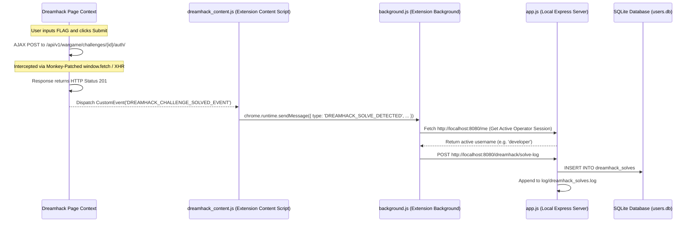

# INHACK Homepage - System Architecture & Solve Tracking Flow

This document details the system architecture and data flows of the INHACK Security Study Group homepage portal and browser extension.

---

## 🏗️ System Overview

The project is split into two core entities:
1. **INHACK Web Portal**: A Node/Express web server running locally (`http://localhost:8080`) backed by a SQLite database (`users.db`) to manage sessions, curriculum, timeline logs, and scoring metrics.
2. **INHACK Chrome Extension**: A browser extension equipped with background workers, popups, and page content injection scripts to integrate browser context with local server databases.

---

## 🚩 Dreamhack Solve Tracking Architecture

Tracking a user's wargame challenge solves on an external portal (`dreamhack.io`) requires bridge-context event propagation. 

### Interceptor Flow Diagram

### Detailed Component Implementation

#### 1. Page Context Monkey Patching (Main World)
Content scripts in Manifest V3 are executed in isolated worlds. They share the page DOM but have separate JavaScript heaps. Thus, a content script cannot directly access or override variables (like `window.fetch`) defined by the page scripts.
* **Mechanism**: `dreamhack_content.js` creates a `<script>` tag dynamically and injects it into the DOM header. This forces the script to execute in the page's **Main World**.
* **Interception**: The injected script overrides `window.fetch` and `XMLHttpRequest.prototype.send` with wrappers.
* **Filter**: It filters requests containing `/wargame/challenges/` and `/auth/`. When a response returns, it checks if the HTTP status code is `201` (indicating successful authentication).
* **Signal**: If status code is `201`, it dispatches a `CustomEvent` named `DREAMHACK_CHALLENGE_SOLVED_EVENT` with the challenge name and ID.

#### 2. Event Routing (Content Script World)
* **Bridge**: `dreamhack_content.js` listens on the `window` object for `DREAMHACK_CHALLENGE_SOLVED_EVENT`.
* **Forwarding**: It translates this DOM event into a Chrome runtime message and transmits it to the background script using `chrome.runtime.sendMessage`.

#### 3. Session Integration (Extension Background Worker)
* **Identity Resolution**: `background.js` catches the solve payload. Because the extension runs in the browser context, it makes a query to `http://localhost:8080/me` to determine who is currently logged into the local portal.
* **Transmission**: If authenticated, it routes the solve details via an HTTP POST request to the local logging server endpoint `/dreamhack/solve-log`.

#### 4. Logging & Auditing (Local Server)
* **Persistence**: The Express server catches the solve parameters, saves the event to the `dreamhack_solves` database table, and appends a human-readable log entry in `log/dreamhack_solves.log`.
