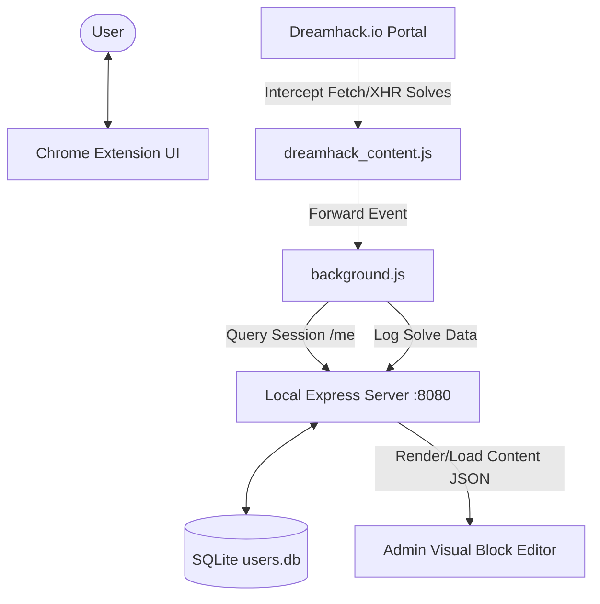

# INHACK Homepage & Chrome Extension - Project Memory

이 문서의 목적은 프로젝트의 전체 아키텍처, 디렉토리 구조, UI/UX 개발 원칙 및 구현 완료된 주요 마일스톤을 요약하여, 향후 AI 어시스턴트가 프로젝트 내의 전체 파일을 반복적으로 읽지 않고도 빠르고 안전하게 개발 컨텍스트를 이해할 수 있도록 돕는 데 있습니다.

---

## 🏗️ 1. System Architecture & Context

프로젝트는 크게 두 개의 코어 서브시스템으로 분리되어 있습니다.

### 1) INHACK Web Portal
* **기술 스택**: Node.js, Express, SQLite3 (세션 및 데이터 관리), Vanilla JS/CSS (HTML 조각 컴파일).
* **로컬 웹 서버**: `http://localhost:8080`에서 실행되며, 커리큘럼, CTF 스코어보드, 메뉴 바 등을 동적으로 로드 및 편집합니다.
* **사용자 관리**: 일반 회원 및 관리자 계정 권한 구분(`is_admin`, `is_blocked` 칼럼) 및 `bcryptjs` 기반 비밀번호 관리.

### 2) INHACK Chrome Extension
* **역할**: 외부 웹 게임 사이트([dreamhack.io](https://dreamhack.io))에서 동아리 회원의 문제 풀이(Solve) 이력을 실시간으로 가로채어 로컬 웹 서버에 동기화합니다.
* **동작 흐름**:
  1. `dreamhack_content.js`가 Dreamhack 페이지 메인 월드(Main World)에 `<script>` 태그를 삽입하여 `window.fetch` 및 `XMLHttpRequest`를 후킹(Monkey-Patching).
  2. 문제 제출 API 호출 응답이 `{ correct: true }`일 시, custom DOM Event(`DREAMHACK_CHALLENGE_SOLVED_EVENT`) 발생.
  3. Content Script가 DOM Event를 감지하여 Background Worker(`background.js`)에 크롬 런타임 메시지 송신.
  4. `background.js`가 로컬 웹 포탈(`:8080/me`)에 세션을 조회하여 현재 로그인한 계정의 식별 정보를 조회하고, 포탈의 `/dreamhack/solve-log`로 풀이 이력 POST 요청.
  5. 로컬 포탈 서버가 수신 데이터를 `users.db` 및 로그 파일(`log/dreamhack_solves.log`)에 동시 기록.

---

## 📂 2. Directory Map

* **`ChromeExtension/`**: Manifest V3 기반의 크롬 확장 프로그램 소스
  * `manifest.json`: 확장 설정 파일
  * `background.js`: 백그라운드 서비스 워커 (이벤트 중계 및 로컬 포탈 API 통신)
  * `content.js`: Dreamhack.io 페이지 후킹용 Content Script
  * `popup.html` / `popup.js` / `popup.css`: 확장 설정 UI
* **`INHACK-Homepage/`**: 메인 웹 포탈 프로젝트 소스
  * **`server/`**: Express 백엔드 API 및 미들웨어
    * `app.js`: 웹 서버 진입점 (포트 `8080` 기동)
    * `config/db.js`: SQLite (`users.db`) 초기화, 컬럼 마이그레이션 및 시딩
    * `helpers/template.js`: JSON 기반 레이아웃 블록 데이터를 정적 HTML로 컴파일하는 템플릿 엔진
    * `routes/`:
      * `admin.js`: 관리자(Admin) 권한 확인, 블록 내용 업데이트, 사용자 등록/제한(Block), 관리자 지정(`/toggle-admin`) 기능 제공
      * `auth.js`: 로그인/로그아웃, 세션 검증, 최초 로그인 시 비밀번호 강제 변경 미들웨어 및 라우트
      * `dreamhack.js`: Dreamhack 가명/식별 세션 관리 및 풀이 이력 로그 수집
      * `pages.js`: 퍼블릭 페이지 라우팅 및 템플릿 컴파일 응답 반환
  * **`src/`**: 프론트엔드 자원
    * `css/style.css`: 전체 사이트 및 관리자 화면 스타일링
    * `html/`:
      * `index.html` (메인 포탈), `login.html` (로그인 페이지), `dreamhack.html` (풀이 트래커)
      * `fragments/`: 페이지별 설정 JSON 데이터 및 렌더링된 정적 HTML 파일들 (`home`, `ctf`, `curriculum`, `seminar`, `navigation`)
    * `js/`:
      * `index.js`: **비주얼 블록 에디터 코어**. 관리자가 UI에서 블록을 직접 추가/삭제/수정하고 2단 분할 드래그 핸들로 화면 리사이즈 및 템플릿 검증 후 서버에 저장하는 핵심 프론트엔드 로직.
      * `auth.js`, `api.js`, `dreamhack.js`, `toast.js`: 헬퍼 유틸리티 및 통신 자바스크립트

---

## 🎨 3. UI/UX & Design Guidelines (`DEVELOPMENT_GUIDELINES.md` 기준)

* **테마**: 기본 다크 Onyx 테마 (배경 `#0b0f19`, 카드/섹션 `#151b2d`).
* **핵심 색상**: Sapphire Blue primary (`#3b82f6` 기본, `#2563eb` 호버), 성공/안전은 Forest Green (`#10b981`), 오류는 Muted Crimson (`#ef4444`).
* **레이아웃**: 구조화되고 정형화된 대학 공식 학술 단체 느낌의 모던 웹 포탈 UI.
* **제한 사항 (매우 중요)**:
  * **글로우/CLI 네온 효과 금지**: 해커/터미널 스타일의 네온 광원, 복잡한 CLI HUD 데코레이션, 네온 스캔라인 그리드 금지.
  * **과도하게 둥근 모서리/파스텔톤 금지**: Toss/Kakao 스타일의 장난스럽고 친근한 둥근 모양(`border-radius: 20px` 이상) 및 파스텔 컬러 금지. (최대 `border-radius: 4px` 수준의 각진 모던 엣지 유지)
* **타이포그래피**: heading 및 body 텍스트는 `Outfit` 폰트 적용. 테크니컬한 값(해시, IP 주소 등)에만 제한적으로 `Fira Code` 모노스페이스 적용.

---

## 🏆 4. Completed Milestone Tasks

- [x] **관리자 패널 탭 분리**: 관리자 대시보드 내 사용자 관리 인터페이스와 컨텐츠 관리 블록 에디터 인터페이스를 깔끔한 사이버네틱 탭 구조로 분리.
- [x] **2단 분할 작업 영역 리사이저**: 블록 에디터 좌측 트리구조와 우측 에디팅 폼 영역 사이에 드래그 가능한 조절 핸들(`.workspace-resizer`) 및 마우스 드래그 리사이징 이벤트 바인딩.
- [x] **에디터 텍스트 영역 개선**: 영어 텍스트 자동 줄바꿈 지원(`word-break: break-word`) 및 cybernetic 스타일의 세로 높이 조절 엣지 고정.
- [x] **네비게이션 메뉴/서브메뉴 관리 시스템**: 사이드바 메뉴바 항목 편집 및 서브메뉴 추가/삭제 시스템 구현. 저장 시 변경사항 즉시 실시간 렌더링 반영.
- [x] **CTF 블록 고도화 및 검증 기능**: 
  * CTF 대시보드 내 문제 분류(Category)를 텍스트 인풋 대신 정해진 드롭다운 셀렉트(`WEB`, `PWN`, `REV`, `CRYPTO`, `FORENSICS`, `MISC`)로 고쳐 유효한 카테고리만 등록 가능하게 개선.
  * 클라이언트(`index.js`)와 서버(`admin.js`의 `/update-content` 라우트) 모두에서 리더보드(`1200 PTS` 포맷, 닉네임 유효성 등)와 챌린지 데이터 포맷 무결성을 정밀 검사하는 검증 로직 구현.
  * 신규 추가된 CTF 카테고리(`crypto`, `forensics`, `misc`) 전용 컬러 뱃지 CSS 고도화.
- [x] **admin.html 인라인 스타일 정리**: `admin.html` 내 사용자 관리 카드, 파일 업로드 폼, 목록 헤더 등에 개별 지정되어 있던 인라인 스타일 코드를 모두 `style.css` 클래스로 이전하고, `index.js`의 사용자 리스트 동적 렌더링 영역 또한 신규 스타일링 클래스를 바라보도록 통합 리팩토링 완료.
- [x] **Dreamhack wargame 문제 풀이 감지 및 연동**:
  * Chrome Extension의 `content.js`가 `dreamhack.io` 페이지 내 AJAX(`fetch` 및 `XMLHttpRequest`) 요청/응답을 메인 월드(Main World) 컨텍스트에서 가로채는 몽키 패치(Monkey-Patch) 자바스크립트를 동적 주입하도록 고도화.
  * 문제 제출 API가 정답(`correct: true`)을 반환할 시 custom DOM Event(`DREAMHACK_CHALLENGE_SOLVED_EVENT`)를 트리거하여 크롬 런타임 메시지를 백그라운드 서비스 워커(`background.js`)로 전송.
  * `background.js`에서 해당 메시지를 수신하여 로컬 포탈의 로그인 세션(/me)을 조회하고, 식별된 사용자의 이름으로 `/dreamhack/solve-log` API에 로그를 전송 및 수집하도록 크롬 확장 로직 완비.
  * 수정한 크롬 확장 소스를 새롭게 압축하여 포탈 다운로드용 배포 압축 파일([INHACK-Extension.zip](file:///mnt/e/Programming/Projects/SII/SII-homepage/INHACK-Homepage/src/INHACK-Extension.zip))에 동기화.
- [x] **계정 별 드림핵 문제 풀이 내역 조회 기능 구현**:
  * 관리자 패널의 사용자 계정 관리 목록에 "푼 문제" 칼럼을 신규 배치하고, SQLite에서 각 계정 별 문제 풀이 수(`solve_count`)를 집계하여 실시간으로 표시.
  * 푼 문제 개수 링크 클릭 시, 해당 사용자가 드림핵 사이트에서 푼 실제 문제 이름과 풀이 일시 목록을 모달 오버레이 팝업(`showUserSolvesModal`)으로 렌더링.
  * 백엔드 관리자 전용 API `/admin/user-solves/:username` 및 프론트엔드 컴포넌트를 구현하여 관리자가 개별 계정의 디테일한 문제 풀이 현황을 손쉽게 추적할 수 있도록 지원.
- [x] **관리자 계정 생성 및 권한 관리 이중화 (최고 관리자 vs 일반 관리자)**:
  * 백엔드 및 프론트엔드를 최고 관리자(Super Admin: `'developer'` 또는 `ADMIN_USERNAME`)와 일반 관리자(Normal Admin) 등급으로 역할 이중화.
  * 어드민 등록 폼의 "관리자 권한 부여" 체크박스 노출 여부 및 사용자 리스트의 "관리자 지정/해제" 버튼 노출 여부를 최고 관리자 로그인 세션에 따라 동적으로 조건부 제어하도록 UI 처리.
  * 등급 제어 권한이 없는 일반 관리자의 백엔드 우회 요청을 차단하기 위해 `/admin/register-user` 및 `/admin/toggle-admin` API 호출 시 최고 관리자 권한 여부 검증 강화.
  * 이미 로그인된 최고 관리자 세션 정보(기존 쿠키)가 있을 경우 로그아웃 없이 즉시 등급 변경 UI가 뜰 수 있도록 `/me` 세션 조회 라우트에서 실시간으로 최고 관리자 여부(`isSuperAdmin`)를 판정 및 주입하도록 최적화.
  * 역할 지정 관련 버튼 명칭 변경 및 다이어트 ("관리자 지정/관리자 해제" ➡️ 2글자 "임명/해임"으로 단축하여 가로 폭 좁아짐에 따른 줄바꿈(행 높이 증가) 차단).
  * 이름 옆에 두껍게 붙어 열 정렬을 깨트리던 `관리자` 등의 텍스트 뱃지 레이아웃을 폐기하고, 아이디(Username) 왼쪽에 심플한 아이콘(`👑` 최고 관리자, `🛡️` 관리자, `🔒` 차단됨) 접두사를 부여하여 정렬 무너짐 방지 및 이름(Name) 열 공간 확보.
  * 비밀번호 입력 시 화면에 원문이 노출되던 브라우저 기본 `prompt()` 입력을 제거하고, 비밀번호가 검은 점으로 안전하게 가려지는 `<input type="password">` 방식의 **보안 검증 확인 모달(`showAdminActionConfirmModal`)**을 자체 개발하여 승인 로직에 연동.

---

## 🧪 5. 필수 테스트 사항 (Required Testing)

* **드림핵 문제 풀이 감지(Solve Interception) 동작 테스트**:
  * **목적**: 크롬 확장 프로그램이 실제 `dreamhack.io` wargame 환경에서 동작하여 플래그 정답 제출 성공 시 풀이 데이터를 정상적으로 가로채 포탈 데이터베이스에 매핑 및 로깅하는지 전과정 검증.
  * **수행 테스트 순서**:
    1. 로컬 포탈 서버 기동 (`npm start` 또는 `npm run dev`).
    2. 로컬 포탈 사이트에 로그인 후 드림핵 연동 페이지 방문.
    3. 최신 크롬 확장 파일([INHACK-Extension.zip](file:///mnt/e/Programming/Projects/SII/SII-homepage/INHACK-Homepage/src/INHACK-Extension.zip))을 다운로드받아 압축 해제 후 크롬 `chrome://extensions/` 페이지에서 개발자 모드 로드로 수동 설치.
    4. 드림핵(`dreamhack.io/wargame/challenges/`)에 접속해 워게임 문제를 임의로 해결하여 정답 플래그 제출.
    5. 제출 성공 후 로컬 포탈의 로그 파일(`log/dreamhack_solves.log`)과 어드민 패널 내 사용자 목록의 `푼 문제` 개수 링크 모달 내에 해결한 챌린지 정보가 실시간으로 쌓이는지 확인.

---

## 🚀 6. Quick Development Commands

* **의존성 설치**: `npm install`
* **개발 서버 기동 (Nodemon 자동 재기동)**: `npm run dev`
* **정적 테스트 기동**: `npm start`

---

> [!NOTE]
> 앞으로 새로운 기능을 설계하거나 디버깅을 시작할 때, `PROJECT_MEMORY.md` 파일을 가장 먼저 로드하여 설계 방향성을 조회하고, 관련 파일을 링크를 따라 읽도록 설계되었습니다.
